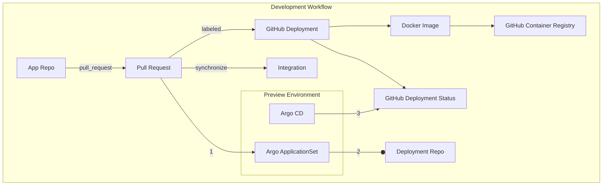
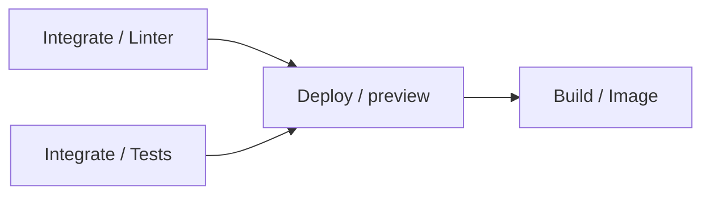
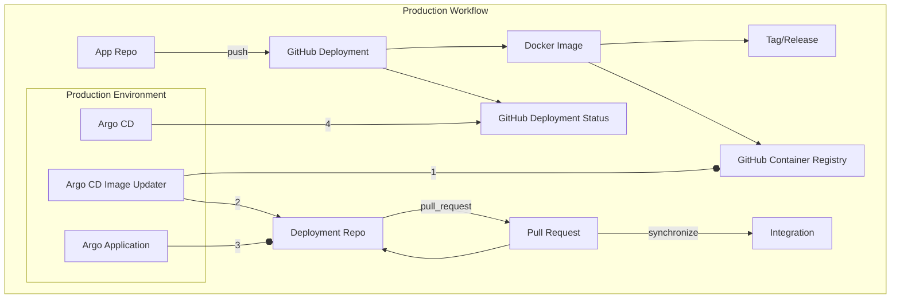
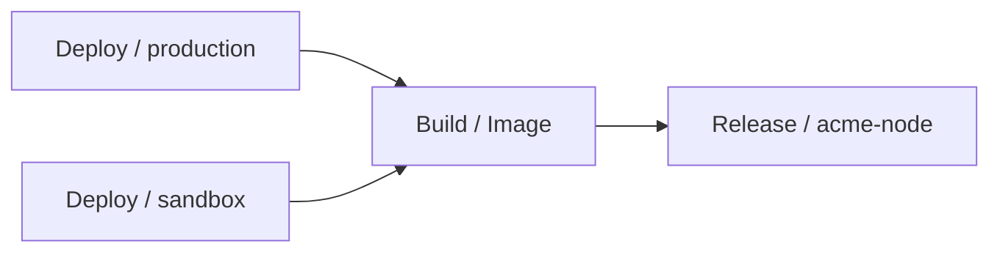

# GitOps CI/CD Pipeline Overview

This organization provides reference implementations for applications that are Continuously Integrated and Deployed using a GitOps-based approach via [Argo CD](https://argo-cd.readthedocs.io/en/stable/) and [GitHub Actions](https://docs.github.com/en/actions), leveraging separate repositories for application code, deployment manifests, and infrastructure configuration.

## Repositories Structure

- [[app]](https://github.com/gitops-ziichat/acme-node) Repository

  Contains the source code for the application, including any workflows. Tags and releases are created here for production deployments. PRs labeled appropriately trigger preview deployments via Argo CD. See [argo-config](https://github.com/gitops-ziichat/argo-config/blob/main/app-of-apps/apps/) for more information.

  Use this template [TODO]().

- [[app]-deployment](https://github.com/gitops-ziichat/acme-node-deployment) Repository

  Holds deployment manifests and configuration files for the application. These repositories are auto discovered by Argo CD for continuous deployment to their applicable environments. See [argo-config](https://github.com/gitops-ziichat/argo-config/blob/main/app-of-apps/apps/) for more information.

  Use this template [TODO]().

- [[app]-infra](https://github.com/gitops-ziichat/acme-node-infra) Repository

  Manages infrastructure resources specific to the application, such as storage or queues, keeping infrastructure configuration separate from application code.

  Use this template [TODO]().

- [[tool]-addon](https://github.com/gitops-ziichat/gateway-api-addon) Repository

  Manages Kubernetes addons and configurations that enhance a cluster's functionality. These repositories are auto discovered by Argo CD for continuous deployment to all clusters. See [argo-config](https://github.com/gitops-ziichat/argo-config/blob/main/app-of-apps/addons/) for more information.

  Use this template [TODO]().

- [.github](https://github.com/gitops-ziichat/.github) Repository

  This is a special repository within GitHub that provides functionality across the organization.

  - [Customizing Organization Profile](https://docs.github.com/en/organizations/collaborating-with-groups-in-organizations/customizing-your-organizations-profile)
  - [Creating Default Community Health Files](https://docs.github.com/en/communities/setting-up-your-project-for-healthy-contributions/creating-a-default-community-health-file)
  - [GitHub Action Workflow Templates](https://docs.github.com/en/actions/sharing-automations/creating-workflow-templates-for-your-organization)
  - [Reusing GitHub Action Workflows](https://docs.github.com/en/actions/sharing-automations/reusing-workflows)

- [.github-private](https://github.com/gitops-ziichat/.github-private) Repository

  This is another special repository within GitHub that [extends profile customization](https://docs.github.com/en/organizations/collaborating-with-groups-in-organizations/customizing-your-organizations-profile#adding-a-member-only-organization-profile-readme).

## Integration Workflow

1. Feature Development and Pull Requests

    - Developers work in feature branches within the app repository.
    - When a pull request (PR) is opened, a GitHub Action initiates linting and unit testing.

1. Automatic Preview Deployments

    - The [Argo CD PR Generator](https://argo-cd.readthedocs.io/en/stable/operator-manual/applicationset/Generators-Pull-Request/) detects PRs labeled with <https://github.com/gitops-ziichat/.github/labels/preview> and generates a transient environment for the branch.
    - The PR-specific environment allows for isolated testing and review on dedicated subdomains.
    - Upon successful deployment, [Argo's Notification tooling](https://argo-cd.readthedocs.io/en/stable/operator-manual/notifications/) sends [deployment status updates to GitHub](https://docs.github.com/en/rest/deployments/deployments), notifying the PR's deployment with statuses `in_progress`, `success`, `failure`, or `error` for real-time feedback on the preview environment.
    - The preview deployment is torn down upon removing the aforementioned label or closing the PR.

    Requests made via the subdomains matching the branch name's [RFC 1123 slug](https://kubernetes.io/docs/concepts/overview/working-with-objects/names/#dns-label-names) of the PR are routed to the preview environment, allowing for easy access to the Preview deployment. The stitching of these requests leverages the [W3C Baggage spec](https://www.w3.org/TR/baggage/), and relies on tracing libraries (such as [otel](https://opentelemetry.io/docs/concepts/signals/baggage/)) to propagate the context from service to service and a service mesh (configured with [gAPI](https://gateway-api.sigs.k8s.io/mesh/)) to route traffic accordingly.

    ```mermaid
    flowchart LR
        url_foo[foo.acme.inc]:::foo
        url_bar[bar.acme.inc]:::bar
        url_sandbox[sandbox.acme.inc]:::main

        url_sandbox --> a

        subgraph main[Sandbox Env]
            a[Service A
                main]:::main
            b[Service B
                main]:::main
            c[Service C
                main]:::main
            d[Service D
                main]:::main

            a --> b --> c --> d
        end

        url_foo -.-> a_foo

        subgraph foo[Preview Env]
            a_foo[Service A
                foo]:::foo
            c_foo[Service C
                foo]:::foo

            a_foo -.-> b -.-> c_foo -.-> d
        end

        url_bar -.-> a

        subgraph bar[Preview Env]
            b_bar[Serice B
                bar]:::bar

            a -.-> b_bar -.-> c -.-> d
        end

        classDef main stroke-width:4px;
        classDef foo stroke:red;
        classDef bar stroke:blue;

        linkStyle 0,1,2,3 stroke-width:4px;
        linkStyle 4,5,6,7 stroke-width:2px,stroke:red;
        linkStyle 8,9,10,11 stroke-width:2px,stroke:blue;
    ```

This flowchart provides some insight into the pipeline of events that trigger CI and CD. The numbers represent the order that deployments happen.



Concretely, that looks like this within the [integration.yaml GitHub Action](https://github.com/gitops-ziichat/.github/blob/main/workflow-templates/integration.yaml).



## Deployment Workflow

1. New Image Detection

    - The new image tagged in the release is automatically detected by [Argo CD Image Updater](https://argocd-image-updater.readthedocs.io/en/stable/).
    - Argo CD Image Updater submits a PR to the [app]-deployment repository with the updated image tag. This PR can be set for manual approval or configured for auto-merge, depending on team practices.

1. Deployment to Production

    - Upon merging to main, Argo CD picks up the updated deployment configuration and rolls out the new image to the production environment.
    - [Argo's Notification tooling](https://argo-cd.readthedocs.io/en/stable/operator-manual/notifications/) then sends [deployment status updates to GitHub](https://docs.github.com/en/rest/deployments/deployments), notifying the deployment with statuses `in_progress`, `success`, `failure`, or `error`.

This flowchart provides some insight into the pipeline of events that trigger CI and CD. The numbers represent the order that deployments happen.



Concretely, that looks like this within the [deployment.yaml GitHub Action](https://github.com/gitops-ziichat/.github/blob/main/workflow-templates/deployment.yaml).



## Summary

These pipelines leverage GitOps principles (via GitHub) and automated deployments (via Argo CD) to ensure a streamlined, consistent deployment process:

- Preview environments for each PR with isolated, PR-specific deployments.
- Automated versioning and tagging upon merging to main, ensuring each production release is traceable.
- Argo CD Image Updater PRs to enforce review controls for production changes or enable auto-rollouts.
- GitHub Deployment Statuses reflect the deployment’s lifecycle, from feature development through production deployment, providing continuous feedback and visibility.

The repositories herein combine GitOps with automated CI/CD workflows, providing both flexibility and control over each stage of deployment, while ensuring the system remains consistent and reliable. This approach allows for rapid development and deployment cycles, while maintaining a high level of quality and consistency across the organization.
